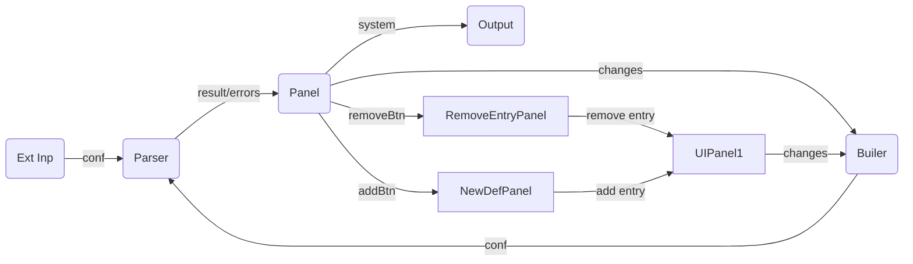

# Leibnitz


**Leibnitz** is a simulator of 3D body trajectories with differential equation


Wiki at https://github.com/m-marini/leibnitz/wiki

## Editor workflow



## Developlment

To start reac dev environment run:
```
npm start
```
